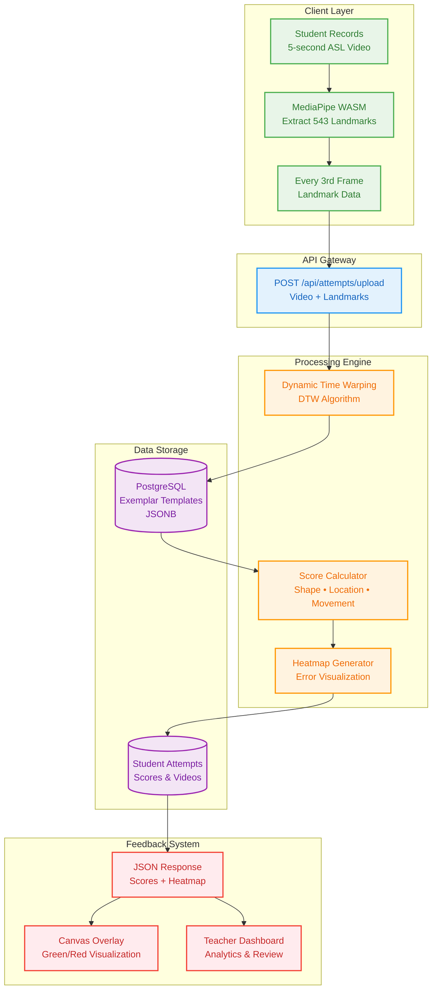

# ASL Vision Grader (ASL-VG) 🤟

A web-based application that evaluates American Sign Language (ASL) signs using computer vision and provides instant feedback to students and comprehensive analytics to teachers.

## 🎯 Project Overview

ASL Vision Grader provides real-time feedback on ASL signing accuracy through:
- **Instant Scoring**: 0-100 scores for handshape, location, and movement accuracy
- **Visual Feedback**: Frame-overlay heat-maps showing correctness (green/red overlays)
- **Sub-3 Second Response**: Feedback appears ≤ 3 seconds after upload
- **Comprehensive Dashboards**: Student progress tracking and teacher analytics

## 🏗️ Architecture



## 🚀 Features

### For Students
- **Quick Practice**: Record 5-second ASL videos with instant feedback
- **Visual Learning**: Green/red overlay heatmaps show exactly where to improve
- **Progress Tracking**: Personal analytics showing improvement over time
- **Multiple Metrics**: Separate scores for handshape, location, and movement
- **Practice History**: Review all previous attempts with detailed breakdowns

### For Teachers
- **Student Management**: Monitor class-wide progress and individual performance
- **Exemplar Management**: Create, edit, and manage reference sign videos
- **Analytics Dashboard**: Comprehensive insights into student learning patterns
- **Video Review**: Playback student attempts with overlay visualizations
- **Performance Trends**: Track class and individual progress over time

## 💻 Tech Stack

| Layer | Technology | Purpose |
|-------|------------|---------|
| **Frontend** | React, TypeScript, Tailwind CSS | Modern responsive web interface |
| **Computer Vision** | MediaPipe WASM | Real-time hand landmark detection (543 points/frame) |
| **Backend** | Supabase (PostgreSQL) | Database, authentication, real-time subscriptions |
| **ML/Scoring** | Dynamic Time Warping (DTW) | Sequence alignment and scoring algorithm |
| **Visualization** | HTML5 Canvas | Real-time overlay rendering |
| **Video Processing** | MediaRecorder API | Client-side video capture at 720p/30FPS |

## 📊 Data Flow

1. **Capture**: Student records 5-second ASL video using MediaRecorder
2. **Extract**: MediaPipe processes every 3rd frame → 543 hand landmarks per frame
3. **Upload**: POST to `/api/attempts/upload` with video + landmark data
4. **Compare**: DTW algorithm aligns student sequence with exemplar templates
5. **Score**: Calculate errors across X/Y/Z dimensions → aggregate into 3 scores
6. **Visualize**: Generate heatmap data for frame-by-frame overlay
7. **Feedback**: Return JSON with scores + normalized heatmap arrays
8. **Display**: Canvas overlay renders green/red indicators on video replay

## 🛠️ Installation & Setup

### Prerequisites
- Node.js 18+ 
- Git
- Modern web browser with WebRTC support

### Quick Start

1. **Clone the repository**
   ```bash
   git clone https://github.com/your-username/ASL-Vision-Grader-ASL-VG.git
   cd ASL-Vision-Grader-ASL-VG
   ```

2. **Install dependencies**
   ```bash
   cd frontend
   npm install
   ```

3. **Environment Configuration**
   ```bash
   cp .env.example .env
   # Edit .env with your Supabase credentials
   ```

4. **Database Setup**
   - Create a Supabase project at [supabase.com](https://supabase.com)
   - Run the migration scripts in `frontend/src/config/migrations/`
   - Seed initial data using `scripts/seed-exemplars.js`

5. **Start Development Server**
   ```bash
   npm run dev
   ```

6. **Access the Application**
   - Open `http://localhost:5173`
   - Create an account or sign in
   - Start practicing ASL signs!

## 📖 Usage Guide

### For Students

1. **Sign Up/Login**: Create your student account
2. **Select a Sign**: Choose from available ASL signs in the Overview tab
3. **Record Practice**: 
   - Click "Practice" button for any available sign
   - Allow camera permissions
   - Record yourself signing for up to 5 seconds
   - Submit your recording
4. **Review Feedback**:
   - View instant scores for handshape, location, movement
   - Watch your video with green/red overlay showing accuracy
   - See detailed breakdowns and suggestions
5. **Track Progress**: Use the "My Attempts" tab to review practice history

### For Teachers

1. **Login**: Access with teacher credentials
2. **Overview Dashboard**: 
   - View class-wide analytics and performance metrics
   - See most practiced signs and student distribution
   - Access quick actions for exemplar and student management
3. **Manage Exemplars**:
   - Create new reference signs by recording demonstrations
   - Edit metadata (name, description, difficulty)
   - Preview existing exemplars with landmark visualization
4. **Student Progress**:
   - Monitor individual student performance
   - Review detailed attempt history
   - Track improvement trends over time
5. **Video Review**:
   - Watch student submissions with overlay analysis
   - Provide feedback and guidance
   - Export performance reports

## 🗂️ Project Structure

```
ASL-Vision-Grader-ASL-VG/
├── frontend/                 # React TypeScript application
│   ├── src/
│   │   ├── components/      # Reusable UI components
│   │   │   ├── auth/       # Authentication forms
│   │   │   ├── student/    # Student dashboard
│   │   │   ├── teacher/    # Teacher dashboard
│   │   │   ├── video/      # Video recording/playback
│   │   │   └── comparison/ # Sign comparison & scoring
│   │   ├── hooks/          # Custom React hooks
│   │   ├── services/       # API integration
│   │   ├── utils/          # DTW algorithm & utilities
│   │   └── types/          # TypeScript definitions
│   ├── public/exemplars/   # Reference sign data
│   └── scripts/            # Database seeding scripts
├── data/                   # Training data and exemplars
├── docs/                   # Documentation and guides
└── README.md              # This file
```

## 🎓 Educational Use & Datasets

### Dataset Attribution

This project uses open datasets for educational purposes:

- **ASLLVD (Boston University)** - CC BY-NC-SA License
  - 3,300+ ASL signs from native signers
  - Used for seeding reference exemplar templates
- **WLASL Dataset** - Research Only License  
  - 2,000+ word vocabulary
  - Kaggle mirror used for training data

### Licensing Compliance

✅ **Educational Use**: Approved for academic and research purposes  
✅ **Attribution**: Proper credits included in application  
❌ **Commercial Use**: Not permitted under dataset licenses  
❌ **Redistribution**: Original datasets not redistributed

## 🔬 Technical Details

### Scoring Algorithm
- **Dynamic Time Warping (DTW)**: Aligns temporal sequences with different speeds
- **Multi-dimensional Analysis**: Compares X, Y, Z coordinates of 543 hand landmarks
- **Error Aggregation**: Converts per-frame differences into 3 skill-specific scores
- **Threshold-based Visualization**: Green/red heatmap based on configurable error thresholds

### Performance Metrics
- **Landmark Extraction**: ~30 FPS on modern laptops
- **Feedback Latency**: < 3 seconds end-to-end
- **Video Quality**: 720p at 30 FPS, max 7 seconds
- **Browser Support**: Chrome, Firefox, Safari (WebRTC required)

## 🚧 Known Limitations

- Requires good lighting and clear hand visibility
- Single-handed signs may have reduced accuracy
- Performance varies with webcam quality
- Limited to pre-defined vocabulary of reference signs

## 🎯 Future Enhancements

- **Real-time Gesture Hints**: Live feedback during signing
- **Multi-sign Phrase Scoring**: Evaluate sentence-level signing
- **Mobile App**: Native iOS/Android applications
- **Advanced Analytics**: ML-powered learning recommendations
- **Accessibility Features**: Screen reader support and captions

## 🤝 Contributing

1. Fork the repository
2. Create a feature branch (`git checkout -b feature/amazing-feature`)
3. Commit your changes (`git commit -m 'Add amazing feature'`)
4. Push to the branch (`git push origin feature/amazing-feature`)
5. Open a Pull Request

## 📄 License

**Non-Commercial Use Only**

This project is licensed for educational and research purposes only. Commercial use is prohibited due to dataset licensing restrictions.

## 🙏 Acknowledgments

- **Boston University ASL Linguistic Research Project** - ASLLVD Dataset
- **WLASL Dataset Contributors** - Kaggle Community
- **Google MediaPipe Team** - Computer vision framework
- **Supabase** - Backend infrastructure
- **React Community** - Frontend framework and ecosystem

---

**Built with ❤️ for the ASL learning community**

For questions or support, please open an issue or contact the development team.