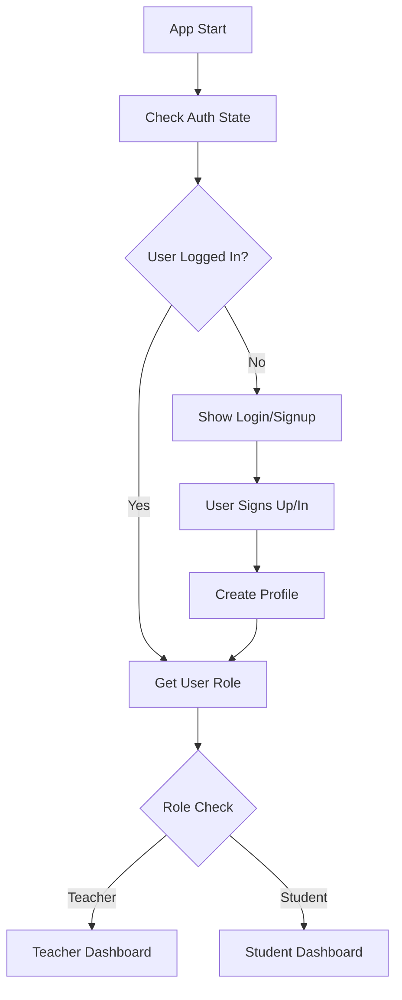
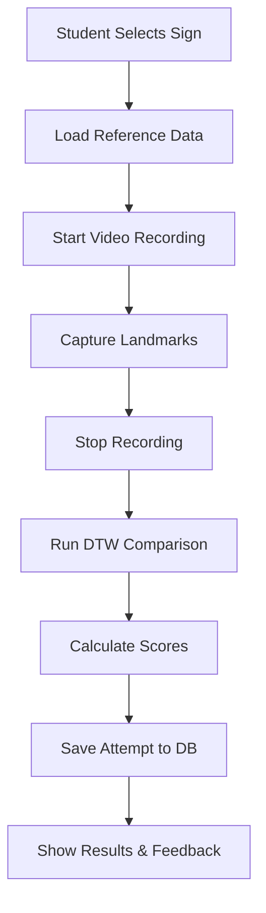

# Authentication & Role-Based Implementation Plan

## Current State Analysis

### ✅ What We Already Have

**Database Schema (Complete & Production Ready):**
- `profiles` table with `user_role` enum ('student', 'teacher')
- `signs` table with all necessary fields (name, description, difficulty, landmarks, etc.)
- `attempts` table for student practice records with scoring
- `feedback` table for teacher comments
- Proper Row Level Security (RLS) policies for role-based access
- Auto-trigger to create profiles on user signup
- Storage buckets for videos and landmarks

**Authentication Infrastructure:**
- Basic `useAuth` hook with Supabase integration
- Auth components: `LoginForm`, `SignupForm`, `UserHeader`
- Role detection via user metadata
- Simple email/password authentication

**Core ASL Features (Fully Functional):**
- `VideoRecorder` with MediaPipe hand tracking
- DTW comparison algorithm with configurable weights
- Comprehensive scoring system (handshape, location, movement, timing)
- Visualization components (`FrameComparison`, `ScoreBreakdown`, `SignComparison`)
- `TeacherDashboard` and `StudentDashboard` components

**Missing/Incomplete Connections:**
- Integration between auth system and main app flow
- `SignList` component needs database connection
- Reference recording doesn't save to database yet
- Student attempts don't save to attempts table

## Implementation Plan

### Phase 1: Connect Existing Auth (Estimated: 30 minutes)

**Goal:** Wire existing authentication to App.tsx with proper role routing

**Changes Required:**
```typescript
// App.tsx - Simple integration
1. Import existing useAuth hook
2. Show LoginForm/SignupForm if not authenticated
3. Route to TeacherDashboard or StudentDashboard based on role
4. Add simple loading states
```

**Components to Update:**
- `App.tsx` - Main routing logic
- No changes needed to existing auth components

**Database Setup:**
- Ensure environment variables are set
- Run existing database-setup.sql and migration

### Phase 2: Complete Data Flow (Estimated: 45 minutes)

**Goal:** Connect all existing components to database operations

**Teacher Flow Implementation:**
```typescript
// ReferenceRecorder.tsx
1. Connect to signs table insertion
2. Upload video/landmarks to Supabase storage
3. Save metadata with proper teacher attribution

// SignList.tsx (for teachers)
1. Fetch signs from database
2. Show edit/delete options for teacher-created signs
3. Display sign statistics
```

**Student Flow Implementation:**
```typescript
// SignList.tsx (for students)
1. Fetch available signs for practice
2. Show difficulty levels and descriptions
3. Navigate to practice mode

// VideoRecorder.tsx (student mode)
1. Save attempts to attempts table
2. Calculate and store scores
3. Generate feedback based on common_mistakes
```

**Database Operations to Implement:**
- Sign creation and retrieval
- Attempt recording and scoring
- Progress tracking for students

### Phase 3: Polish Role Separation (Estimated: 30 minutes)

**Goal:** Ensure clean separation between teacher and student experiences

**Teacher Dashboard Features:**
- Record new reference signs
- View all signs library with management options
- Basic analytics (how many students practiced each sign)
- Review student attempts and add feedback

**Student Dashboard Features:**
- Browse available signs by difficulty/category
- Practice selected signs with immediate feedback
- View personal progress and attempt history
- Access to detailed scoring breakdowns

**UI/UX Improvements:**
- Clear role indicators in headers
- Contextual help text for each mode
- Error handling and loading states
- Success messages for completed actions

## Technical Implementation Details

### Authentication Flow


### Data Flow for Sign Practice


### Database Schema Usage
```sql
-- Example teacher creating a sign
INSERT INTO signs (name, description, difficulty, exemplar_landmarks, created_by)
VALUES ('Hello', 'Wave your hand...', 1, '[landmark_data]', auth.uid());

-- Example student attempt
INSERT INTO attempts (student_id, sign_id, score_shape, score_location, score_movement, video_url)
VALUES (auth.uid(), sign_id, 85.5, 92.0, 78.3, 'storage_url');
```

## Simple Environment Setup

### Required Environment Variables
```bash
# .env file
VITE_SUPABASE_URL=your_supabase_project_url
VITE_SUPABASE_ANON_KEY=your_supabase_anon_key
```

### Supabase Setup Steps
1. Create new Supabase project
2. Run `database-setup.sql` in SQL editor
3. Run `002_update_signs_table.sql` migration
4. Create storage buckets: 'videos' and 'landmarks' (public access)
5. Copy project URL and anon key to environment variables

## Testing Strategy

### Manual Testing Checklist
- [x] **Phase 1 Complete**: Basic auth integration with App.tsx
- [x] User authentication flow implemented
- [x] Role-based routing (teacher/student dashboards)
- [x] Simple login/signup forms created
- [x] useAuth hook enhanced with profile loading
- [ ] User can sign up as teacher/student (needs .env setup)
- [ ] Teacher can record and save reference signs
- [ ] Student can browse and select signs
- [ ] Student can practice and receive scores
- [ ] Role-based access works correctly
- [ ] Data persists between sessions

### Key Integration Points to Test
1. Auth state persistence across page refreshes
2. Database operations with proper user attribution
3. File uploads to Supabase storage
4. Real-time landmark processing and comparison
5. Score calculation accuracy


## Risk Mitigation

### Potential Issues & Solutions
1. **MediaPipe Loading**: Already handled with proper initialization checks
2. **File Upload Limits**: Supabase has generous limits for free tier
3. **Database Permissions**: RLS policies already implemented
4. **Performance**: DTW algorithm optimized with windowing
5. **Browser Compatibility**: MediaPipe works in modern browsers

### Rollback Plan
- Keep current working App.tsx as backup
- Implement auth in separate branch first
- Test thoroughly before merging
- Database migrations are additive (safe to rollback)

## Success Criteria

### Phase 1 Success
- Users can log in and see appropriate dashboard
- Role-based routing works correctly
- No breaking changes to existing functionality

### Phase 2 Success
- Teachers can create and manage signs
- Students can practice existing signs
- Scores are calculated and stored correctly

### Phase 3 Success
- Clean, intuitive user experience
- All data operations work reliably
- System ready for production use

## Implementation Status

### ✅ Phase 1 Complete: Auth Integration (~30 minutes)

**What was implemented:**
1. **App.tsx Complete Rewrite**: 
   - Integrated authentication flow with loading states
   - Simple, clean login/signup forms (no complex 2FA)
   - Role-based routing to existing TeacherDashboard/StudentDashboard
   - Header with user info and sign out functionality

2. **Enhanced useAuth Hook**:
   - Added profile loading from database
   - Fallback to user metadata if profile doesn't exist
   - Proper loading states and error handling
   - Role detection via profiles table

3. **Ready for Testing**:
   - Need `.env` file with Supabase credentials
   - Need database setup (existing SQL files)
   - All existing components (VideoRecorder, DTW, etc.) preserved

**Files Modified:**
- `/frontend/src/App.tsx` - Complete auth integration
- `/frontend/src/hooks/useAuth.ts` - Enhanced with profile loading

**Next Steps:**
- Set up `.env` file with Supabase credentials
- Run database setup scripts
- Test auth flow and role routing

## Timeline Estimate

**Total Implementation Time: ~2 hours**
- ✅ Phase 1 (Auth Integration): 30 minutes **COMPLETE**
- Phase 2 (Data Flow): 45 minutes  
- Phase 3 (Polish): 30 minutes
- Testing & Bug Fixes: 15 minutes

**Remaining Work:** ~1.5 hours for database connections and polish.
