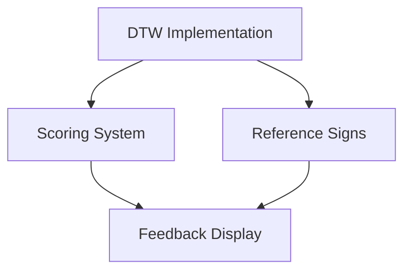

# Current Task Status and Next Steps

## Completed Tasks ✅

### Video Recording & Processing
- Video recording component with webcam capture
- Frame extraction system
- MediaPipe hand landmark detection
- Real-time landmark visualization
- Video preview and playback

### Storage & Upload
- Supabase project setup
- Storage buckets configuration
- Video upload functionality
- Landmark data upload
- Upload progress tracking
- Retry mechanism

### UI Components
- Recording controls
- Video preview
- Landmark visualization
- Upload progress indicators
- Playback controls

## Next Priority Tasks 🎯

### 1. DTW Implementation
```
Priority: HIGH
Dependencies: None (can start immediately)
Files to Create:
- src/utils/dtw.ts
- src/hooks/useComparison.ts
- src/components/comparison/ScoreDisplay.tsx
```

### 2. Reference Signs System
```
Priority: HIGH
Dependencies: DTW Implementation
Files to Create:
- src/components/signs/ReferenceRecorder.tsx
- src/services/signService.ts
- src/types/signs.ts
```

### 3. Scoring System
```
Priority: HIGH
Dependencies: DTW Implementation
Files to Create:
- src/utils/scoring.ts
- src/components/feedback/ScoreCard.tsx
- src/components/feedback/Heatmap.tsx
```

### 4. User Authentication
```
Priority: MEDIUM
Dependencies: None
Files to Create:
- src/components/auth/LoginForm.tsx
- src/components/auth/SignUpForm.tsx
- src/hooks/useAuth.ts
```

## Task Dependencies



## Getting Started Context

For the next prompt, you should focus on the DTW implementation:

1. Start with `src/utils/dtw.ts`:
   - Implement core DTW algorithm
   - Add distance calculations
   - Create scoring functions

2. Then create `src/hooks/useComparison.ts`:
   - Manage comparison state
   - Handle landmark alignment
   - Calculate scores

3. Finally, add `src/components/comparison/ScoreDisplay.tsx`:
   - Show comparison results
   - Visualize differences
   - Display scores

This will set up the foundation for comparing student attempts with reference signs.


