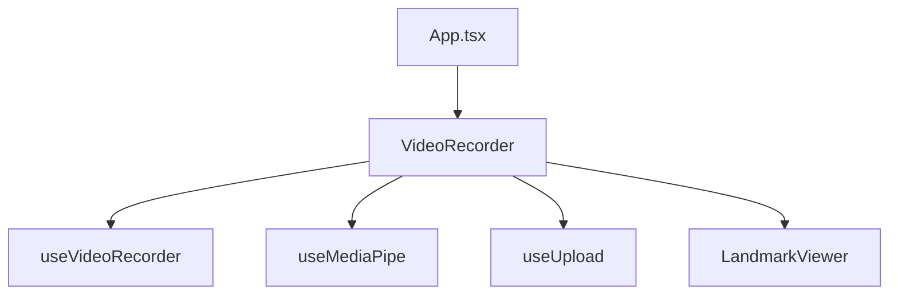
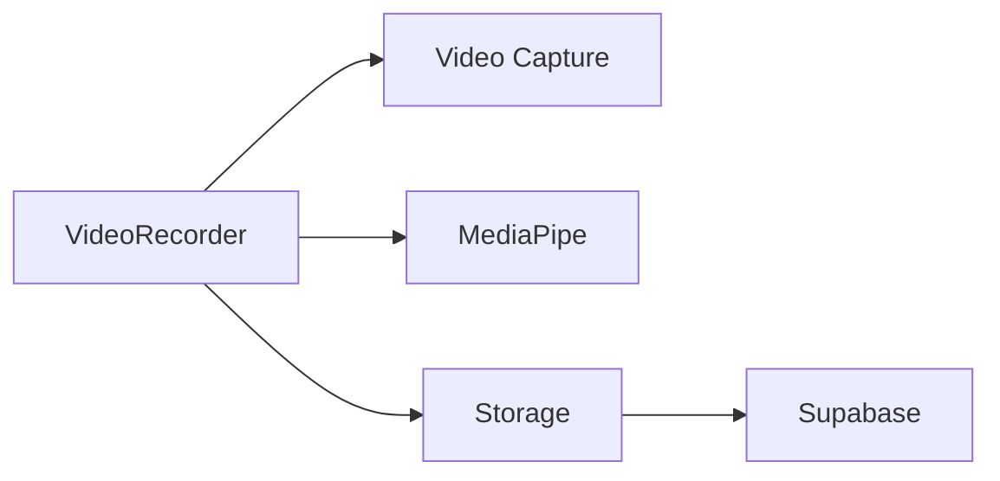

# ASL Vision Grader - Implementation Status

## Completed Features

### 1. Video Recording System
- ✅ Webcam capture at 720p/30FPS
- ✅ Recording controls (start/stop)
- ✅ Video preview with playback
- ✅ Automatic cleanup of video resources
- ✅ Error handling for device access

### 2. MediaPipe Integration
- ✅ Hand landmark detection
- ✅ Real-time landmark visualization
- ✅ Frame extraction (30fps)
- ✅ Landmark data collection during recording
- ✅ Error handling for detection failures

### 3. Storage System
- ✅ Supabase project setup
- ✅ Storage buckets configuration
- ✅ Video upload functionality
- ✅ Landmark data upload
- ✅ Automatic retry mechanism
- ✅ Upload progress tracking

### 4. Landmark Visualization
- ✅ Frame-by-frame playback
- ✅ Play/pause/step controls
- ✅ Visual representation of hand points
- ✅ Metadata display (duration, frame rate)
- ✅ Canvas-based rendering

## Component Structure

### Key Components
1. **VideoRecorder**
   - Manages video capture and recording
   - Integrates with MediaPipe
   - Handles upload process
   - Shows recording controls and status

2. **LandmarkViewer**
   - Displays recorded landmarks
   - Provides playback controls
   - Shows metadata and statistics
   - Visualizes hand tracking points

### Custom Hooks
1. **useVideoRecorder**
   - Manages MediaRecorder API
   - Handles recording state
   - Provides blob data
   - Error handling

2. **useMediaPipe**
   - Initializes MediaPipe
   - Processes video frames
   - Extracts landmarks
   - Manages detection state

3. **useUpload**
   - Handles file uploads
   - Manages upload progress
   - Provides retry logic
   - Error handling

## Data Flow

### Recording Process
1. User starts recording
2. Video stream captured
3. MediaPipe processes frames
4. Landmarks collected
5. Recording stopped
6. Files uploaded to Supabase
7. Landmarks visualized

### Storage Structure
- videos/
  - recording-{timestamp}.webm
- landmarks/
  - landmarks-{timestamp}.json

## Next Steps

### 1. DTW Implementation (Priority)
- [ ] Implement DTW algorithm
- [ ] Create scoring system
- [ ] Add comparison visualization
- [ ] Implement feedback generation

### 2. Reference Signs
- [ ] Create reference sign storage
- [ ] Add reference recording interface
- [ ] Implement sign metadata
- [ ] Add sign categorization

### 3. User Interface
- [ ] Add sign selection interface
- [ ] Create feedback display
- [ ] Implement progress tracking
- [ ] Add user dashboard

### 4. Authentication
- [ ] Implement user roles
- [ ] Add login/signup
- [ ] Set up permissions
- [ ] Create user profiles

## Technical Debt & Improvements

### Performance
- Optimize landmark data format
- Add video compression
- Implement caching
- Optimize canvas rendering

### Error Handling
- Add more comprehensive error states
- Improve error recovery
- Add error reporting
- Implement fallback modes

### Testing
- Add unit tests
- Implement integration tests
- Add performance testing
- Create test fixtures

## File Dependencies



## Component Flow



## Getting Started

1. Clone the repository
2. Install dependencies:
   ```bash
   npm install
   ```
3. Set up environment variables:
   ```env
   VITE_SUPABASE_URL=your-url
   VITE_SUPABASE_ANON_KEY=your-key
   ```
4. Start development server:
   ```bash
   npm run dev
   ```

## Known Issues

1. Landmark visualization needs optimization
2. Upload retry could be more robust
3. Error states need better UI feedback
4. Memory usage during long recordings

## Recommendations

1. Focus on DTW implementation next
2. Add proper error boundaries
3. Implement proper testing
4. Add performance monitoring
5. Improve documentation


