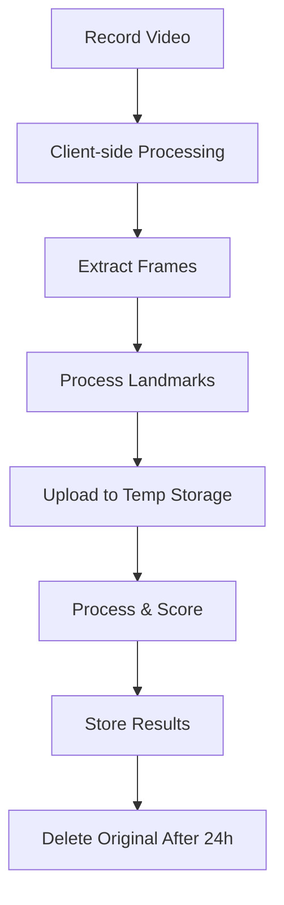

# Video Storage Strategy Analysis

## 1. Requirements Analysis

### Video Characteristics
- Duration: 5-7 seconds per attempt
- Resolution: 720p
- Frame Rate: 30 FPS
- Format: MP4 (assumed for web compatibility)
- Estimated Size: ~2-3MB per video (compressed)

### Usage Patterns
- Frequent uploads (multiple attempts per student)
- Quick access needed (≤ 3s requirement)
- Temporary access (during review)
- Need for video playback with overlay

## 2. Storage Options Comparison

### Option 1: Supabase Storage
**Pros:**
- Built-in integration
- Simple setup
- CDN included
- Good for small-scale

**Cons:**
- Limited free tier (1GB)
- Could get expensive at scale
- Less optimization options
- Regional limitations

### Option 2: AWS S3 + CloudFront
**Pros:**
- Highly scalable
- Cost-effective for large scale
- Global CDN
- More control over optimization

**Cons:**
- More complex setup
- Separate service to manage
- Additional infrastructure
- Higher initial setup time

### Option 3: Hybrid Approach (Recommended) ✅
**Strategy:**
1. **Temporary Supabase Storage**
   - Store videos during processing
   - Keep for immediate review
   - Delete after processing (save landmarks only)

2. **Long-term AWS S3 Storage** (Optional)
   - Archive important videos
   - Store exemplar videos
   - Backup selected attempts

## 3. Implementation Plan

### 3.1 Video Processing Flow


### 3.2 Storage Structure
```
storage/
├── temp/
│   └── attempts/
│       ├── {student_id}/
│       │   └── {attempt_id}.mp4    # Deleted after 24h
│       └── processing/             # During processing
├── permanent/
│   ├── exemplars/
│   │   └── {sign_id}.mp4          # Reference videos
│   └── archived/
│       └── {student_id}/          # Selected important attempts
└── landmarks/
    ├── attempts/
    │   └── {attempt_id}.json      # Permanent landmark data
    └── exemplars/
        └── {sign_id}.json         # Reference landmarks
```

## 4. Storage Management Strategy

### 4.1 Immediate Storage (During Upload)
1. Client uploads video to temporary storage
2. System processes video and extracts landmarks
3. Landmarks stored in database (JSONB)
4. Video remains available for immediate review

### 4.2 Cleanup Process
```typescript
// Automated cleanup after 24 hours
const cleanupVideo = async (attemptId: string) => {
  // 1. Check if video needs archiving
  // 2. Delete from temporary storage
  // 3. Update database record
  // 4. Keep only landmark data
};
```

### 4.3 Archival Rules
- Keep exemplar videos permanently
- Archive videos marked as "important" by teachers
- Store only landmarks for regular attempts
- Maintain video URL structure in database

## 5. Cost Analysis

### 5.1 Storage Requirements
Per student per month (estimated):
- 20 attempts × 3MB = 60MB raw video
- 1MB landmarks data
- Total: ~61MB per student/month

### 5.2 Cost Optimization
1. **Immediate Deletion**
   - Delete videos after processing
   - Keep only landmark data
   - Save ~95% storage space

2. **Selective Archival**
   - Archive only important videos
   - Use compression for archives
   - Implement retention policies

3. **Caching Strategy**
   - Cache frequently accessed videos
   - Use CDN for exemplars
   - Implement client-side caching

## 6. Security Considerations

### 6.1 Access Control
```sql
-- Supabase Storage RLS
CREATE POLICY "Students can access own videos"
ON storage.objects
FOR SELECT
USING (
  auth.uid()::text = (storage.foldername)[1]
);
```

### 6.2 Video Protection
- Signed URLs for access
- Expiring links for sharing
- Encryption at rest
- Secure upload endpoints

## 7. Implementation Recommendations

### Phase 1: Basic Setup
1. Configure Supabase storage buckets
2. Implement upload flow
3. Set up temporary storage rules
4. Create cleanup jobs

### Phase 2: Optimization
1. Add compression
2. Implement caching
3. Set up monitoring
4. Add archival rules

### Phase 3: Scaling (if needed)
1. Integrate AWS S3
2. Set up CloudFront
3. Implement migration
4. Update access patterns

## 8. Monitoring and Maintenance

### 8.1 Metrics to Track
- Storage usage
- Upload success rate
- Processing time
- Access patterns
- Cleanup efficiency

### 8.2 Alerts
- Storage capacity
- Failed uploads
- Processing errors
- Cleanup failures

## 9. Backup Strategy

### 9.1 Regular Backups
- Daily landmark data backup
- Weekly exemplar backup
- Monthly archived video backup

### 9.2 Disaster Recovery
- Multiple region copies
- Version control for landmarks
- Automated recovery procedures

## 10. Success Criteria

- Upload time < 3 seconds
- Processing time < 5 seconds
- Storage cost < $0.1 per student/month
- 99.9% upload success rate
- 100% landmark data retention